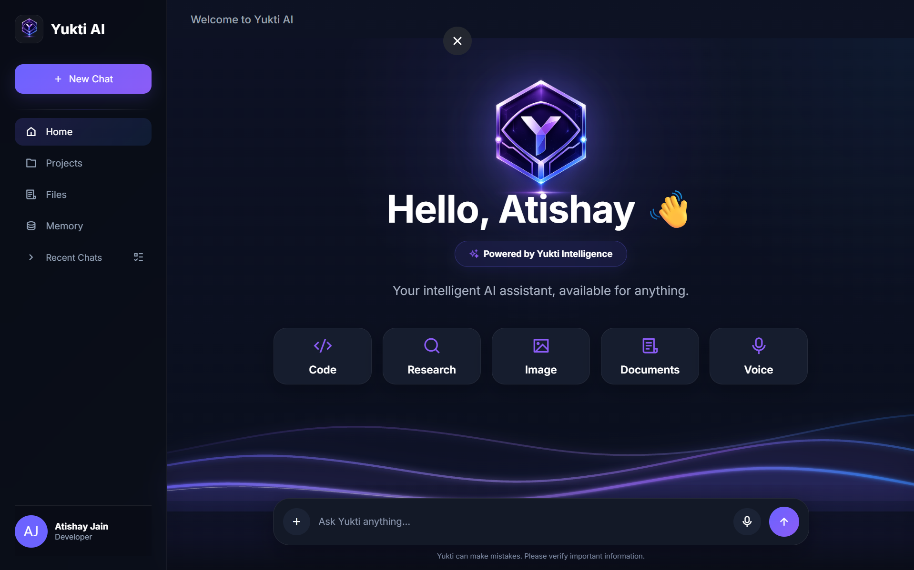

# Yukti AI

### A Multi-Model AI Assistant for Intelligent and Seamless Conversations

**Yukti AI** is an AI assistant project focused on creating a fast, modern, and intelligent conversational experience using multiple AI models and providers.

The project is being developed as a practical exploration of **Generative AI, Large Language Models (LLMs), AI APIs, prompt engineering, and full-stack AI application development**.

Yukti AI integrates multiple AI providers including OpenRouter, Google Gemini, and Groq through a unified backend architecture, with optional OpenAI fallback support and Tavily-powered search capabilities.

> **Project Status:** 🚧 Actively under development

---

## ✨ Features

- 💬 Modern conversational AI interface
- 🤖 Multi-model AI support
- 🔄 AI provider integration
- ⚡ Streaming AI responses
- 🧠 Prompt-based AI interaction
- 📱 Responsive user interface
- 🔊 Voice-assistant functionality
- 🔧 Separate frontend and backend architecture

---

## 🛠️ Tech Stack

### Frontend
- HTML5
- CSS3
- JavaScript

### Backend
- Python
- FastAPI
- Uvicorn

### AI & APIs
- OpenRouter API
- Google Gemini API
- Groq API
- OpenAI API (Fallback Support)
- Tavily API
- Large Language Models (LLMs)
- Prompt Engineering

### Development Tools
- Git
- GitHub
- VS Code

---

## 📁 Project Structure

Yukti AI follows a modular frontend and backend architecture:

```text
Yukti-AI/
├── backend/
│   ├── brain/        # Core AI orchestration and logic
│   ├── config/       # Application and model configuration
│   ├── models/       # Data and application models
│   ├── providers/    # AI provider integrations
│   ├── tools/        # AI tools and supporting functionality
│   └── main.py       # FastAPI application entry point
│
├── frontend/         # User interface and client-side functionality
├── .gitignore
├── LICENSE
├── README.md
└── requirements.txt
```

---

## ⚙️ Installation & Setup

Follow these steps to run Yukti AI locally.

### 1. Clone the Repository

```bash
git clone https://github.com/atishay-jain-ai/Yukti-AI.git
cd Yukti-AI

```

### 2. Create a Virtual Environment

```bash
python -m venv venv
```

Activate the virtual environment:

**Windows**

```bash
venv\Scripts\activate
```

**macOS / Linux**

```bash
source venv/bin/activate
```

### 3. Install Dependencies

Install all required Python packages using:

```bash
pip install -r requirements.txt
```

### 4. Configure Environment Variables

Create your local environment file using the provided `.env.example` template:

```bash
cp .env.example .env

```env
GEMINI_API_KEY=your_gemini_api_key
GROQ_API_KEY=your_groq_api_key
OPENROUTER_API_KEY=your_openrouter_api_key
TAVILY_API_KEY=your_tavily_api_key

OPENAI_API_KEY=your_openai_api_key
ENABLE_OPENAI_FALLBACK=false

APP_NAME=Yukti AI
APP_ENVIRONMENT=development
DEBUG=true
```

> Never commit your `.env` file or API keys to GitHub.

### 5. Start the Backend

From the project root, run:

```bash
uvicorn backend.main:app --reload
```

The FastAPI development server will start locally.

---

### 6. Start the Frontend

Open the project in VS Code.

Navigate to:

```text
frontend/index.html
```

Right-click `index.html` and select:

```text
Open with Live Server
```

The Yukti AI interface will open in your browser.

> Make sure the FastAPI backend is already running before using AI features.

---

## 🗺️ Roadmap

Yukti AI is under active development. Planned improvements include:

- [ ] React-based frontend
- [ ] Retrieval-Augmented Generation (RAG)
- [ ] Vector database integration
- [ ] LangChain integration
- [ ] AI agent capabilities
- [ ] Conversation memory
- [ ] Improved voice interaction
- [ ] Image generation support
- [ ] Docker containerization
- [ ] User authentication
- [ ] Production deployment

---

## 🖥️ Project Preview

<p align="center">
  
</p>

> Yukti AI's current interface featuring AI chat, research, coding, document, image, and voice interaction options.

---

## 🚀 Usage

Once the backend and frontend are running, Yukti AI can be used for:

- General AI conversations
- Coding assistance
- Research-oriented queries
- Image-related interactions
- Document-based workflows
- Voice-based interaction
- Multi-provider AI responses

> Some features may still be under active development or experimental.

---

## 🤝 Contributing

Yukti AI is currently an actively developing personal AI project.

Suggestions, feedback, and future contributions are welcome as the project evolves.

---

## 📄 License

This project is licensed under the **MIT License**.

See the [LICENSE](LICENSE) file for details.

---

## 👨‍💻 Author

**Atishay Jain**

AI & ML Student • Creator of Yukti AI • Full-Stack Developer

[LinkedIn](https://www.linkedin.com/in/atishay-jain-ai/) • [GitHub](https://github.com/atishay-jain-ai)

---

### Yukti AI

**Learning • Building • Innovating**
